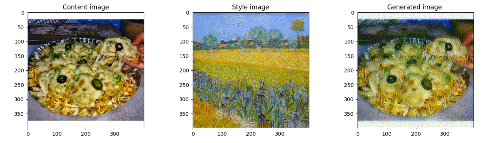

# 🎨 Neural Style Transfer

This [notebook](neural_style_transfer_dl.ipynb) showcases Neural Style Transfer (NST) using a pre-trained VGG19 model. It combines the **content** of one image with the **style** of another by selecting specific VGG19 layers for style and content representation, iteratively optimizing a generated image to balance content preservation with style application.

The project goes end-to-end — from training in a notebook to a fully deployed interactive web application.

---

## 🚀 Live Demo

Try it on Hugging Face Spaces → https://ramandrosoa-neural-style-transfer.hf.space/

---

## 🛠️ Tech Stack


---

## 📁 Project Structure

```
├── neural_style_transfer_dl.ipynb  # Training notebook
├── nst_deploy.py                   # NST logic as a callable module
├── api.py                          # FastAPI server
├── nst_ui.html                     # Web UI
├── requirements.txt
├── Dockerfile
└── style/                          # Kaggle artwork images
```

---

## ⚙️ How It Works

### 1. 🧠 Model — VGG19
A pre-trained VGG19 (ImageNet weights) is used as a **frozen feature extractor** — its weights never change. Specific intermediate layers are selected to capture:
- **Content** representation → `block5_conv4`
- **Style** representation → `block1-5_conv1` (Gram matrices)

### 2. 📉 Training
Unlike classical ML, there is no dataset training. Instead, for each new image pair, the model **optimizes the generated image itself** from scratch using gradient descent:

```
Minimize J = α · J_content + β · J_style
```

Where `α` and `β` control the balance between content preservation and style application.

---

## 🎛️ Hyperparameters
The following values were selected in the training notebook. In the app, these hyperparameters can be adjusted via the UI.
| Parameter | Default | Description |
|---|---|---|
| `learning_rate` | `0.005` | Adam optimizer learning rate |
| `epochs` | `501` | Number of optimization steps |
| `alpha` | `30` | Content loss weight |
| `beta` | `10` | Style loss weight |

---

## 💡 Applications

- 🏥 [Medical image segmentation improvement](https://arxiv.org/abs/1909.09716)
- 📦 Data augmentation
- 🖼️ Artistic image creation

---
## 🖼️ Example Result
 

## 📚 References

- [Convolutional Neural Networks — DeepLearning.AI](https://www.coursera.org/learn/convolutional-neural-networks?specialization=deep-learning)
- [A Neural Algorithm of Artistic Style — Gatys et al.](https://arxiv.org/abs/1508.06576)
